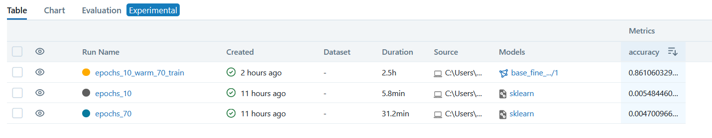

# Reporte del Modelo Final

## Resumen Ejecutivo

El modelo con fine tunning entrenado con 10 épocas de calentamiento y 70 de entrenamiento, presenta un accuracy de 86% durante la experimentación.

## Descripción del Problema

El presente proyecto no tiene un campo de aplicación específico, sin embargo puede tomarse como verificador de identidad de una persona basada en una o más imágenes previas cargadas en un sistema, de esta manera el sistema permitiría distinguir personas de una base potencial.

Para ello el principal problema de este verificador de identidad es ¿cómo reconocer a una persona? y posteriormente ¿cómo diferenciarla del resto?. 

## Descripción del Modelo

El modelo usado es un fine tunning del modelo Resnet50, aprovechando los pesos que este ya tiene, se modifica ligeramente durante 70 épocas para que su poder de inferencia sea aplicado a este problema particular.

## Evaluación del Modelo

Se obtiene un 86% de accuracy al trabajar con los datos de validación, la experimentación se guardó usando mlflow permitiendo tener trazabilidad del proceso.

## Conclusiones y Recomendaciones

Los modelos base, requieren ser tunneados para que se ajusten al problema particular, un gran tiempo de entrenamiento provee mejores resultados siempre y cuando se liberen las capas para reentrenar los pesos.

Un mayor tiempo de entrenamiento podría ofrecer mejores resultados, sin embargo podría caer en sobreajuste dado el limitado número de ejemplos que se tienen por etiqueta.

